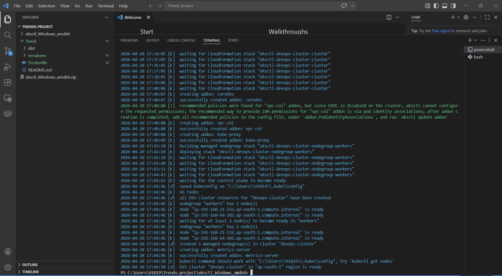
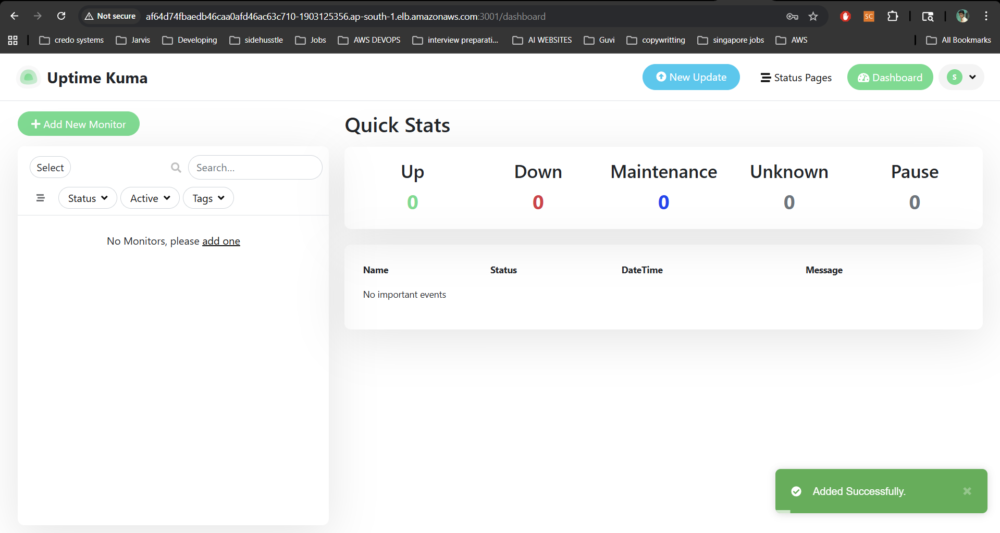
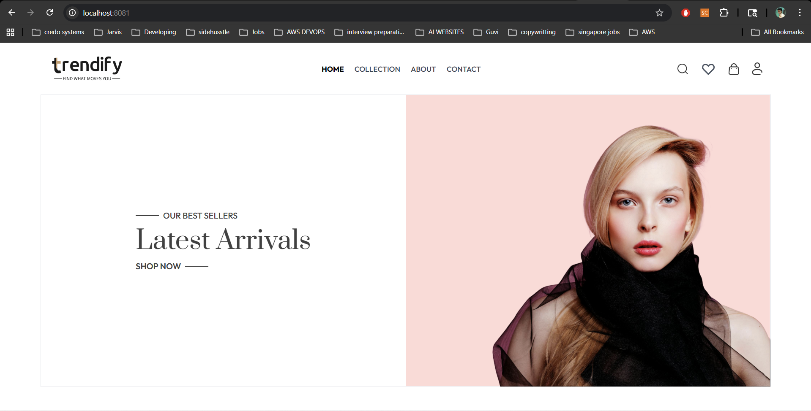

## 🚀 DevOps Practice Project – Dist Directory
This repository contains the production-ready build (dist folder) for deployment and DevOps practice.
Application credit: Vennilavanguvi

## 📁 Contents
- dist/ – HTML, CSS, JS, and assets
- Ready for deployment on:
- Nginx / Apache
- AWS S3 / Cloud
- Docker / Kubernetes
- CI/CD pipelines

## 🎯 Purpose
Used for DevOps practice: CI/CD, Docker, Kubernetes, and deployment workflows.

## ❓ Note
No package.json or source code because this is already a built application (production output).

## 👨‍💻 Credits
Developer: Vennilavanguvi
DevOps: Your Name

# 🚀 DevOps Practice Project – Trend Application Deployment

This repository demonstrates a complete **end-to-end DevOps workflow** for deploying the Trend application.  
**Application credit: Vennilavanguvi**

---

## 📁 Repository Contents

### 🔹 Application
- Node.js application (runs on port 3000)
- `dist/` – Production build (HTML, CSS, JS, assets)

### 🔹 DevOps Files
- `Dockerfile` – Containerization  
- `Jenkinsfile` – CI/CD pipeline  
- `main.tf` – Terraform infrastructure  
- `deployment.yaml` – Kubernetes deployment  
- `service.yaml` – Kubernetes service  
- `.gitignore`, `.dockerignore`

---

## 🎯 Purpose

This project is created for **DevOps practice**, covering:

- CI/CD pipeline implementation  
- Docker image creation & push  
- Kubernetes (AWS EKS) deployment  
- Terraform infrastructure provisioning  
- Jenkins automation  
- GitHub integration with webhooks  

---

## ⚙️ Application Details

- Runs on **port 3000**
- Built using **Node.js**
- Containerized with **Docker**
- Deployed on **Kubernetes (EKS)**

---

## 🐳 Docker

- Docker image built using `Dockerfile`
- Image pushed to DockerHub repository

---

## ☁️ Terraform Infrastructure

Provisioned using `main.tf`:

- VPC  
- Subnets  
- IAM roles  
- EC2 instance (Jenkins server)  
- EKS cluster  

---

## ☸️ Kubernetes Deployment

- Application deployed using:
  - `deployment.yaml`
  - `service.yaml`
- Running inside AWS EKS cluster  

---
### 🔹 Kubernetes Cluster

## 🔄 CI/CD Pipeline (Jenkins)

Pipeline stages:

1. Code checkout from GitHub  
2. Docker image build  
3. Push image to DockerHub  
4. Deploy to Kubernetes  

---

## 🔗 GitHub Integration

- Webhook configured  
- Automatically triggers Jenkins build on every commit  

---

## ❓ Note

The `dist/` folder contains **production-ready build files only**.  
No `package.json` or source code is included.

---

## Monitoring
### 🔹 Uptime / Monitoring

## ✅ Outcome

- Application deployed on port 3000  
- Docker image successfully built and pushed  
- Infrastructure provisioned using Terraform  
- EKS cluster running  
- Application deployed on Kubernetes  
- CI/CD fully automated  

---
### 🔹 Application (Trendify UI)

## 📄 Documentation

Detailed documentation is available here:  
👉 [View Project PDF](./docs/Trends -project2.pdf)

---
## 👨‍💻 Author

**Shiva Rama Krishnan**
